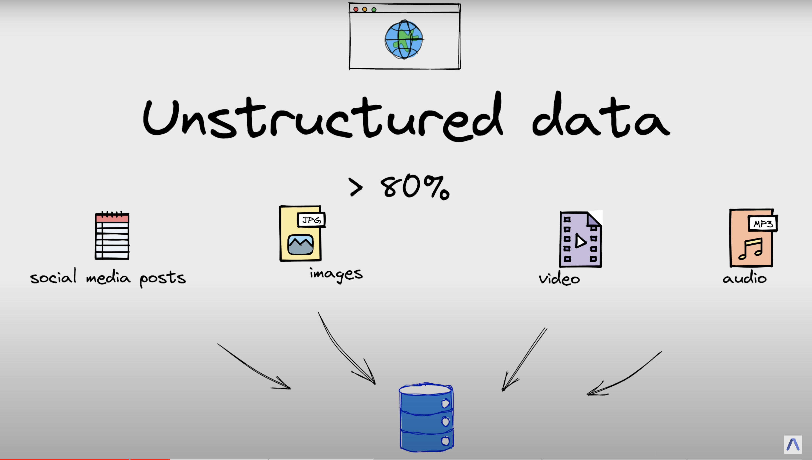
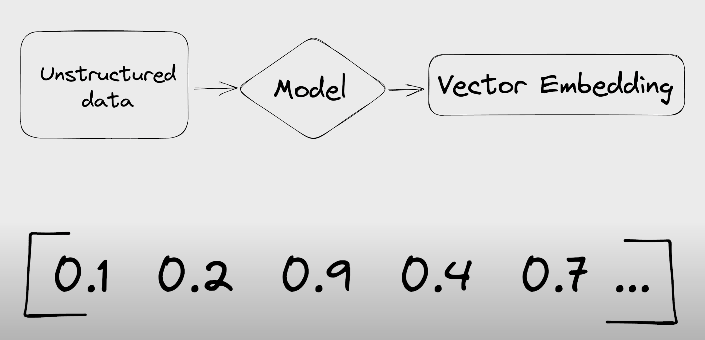
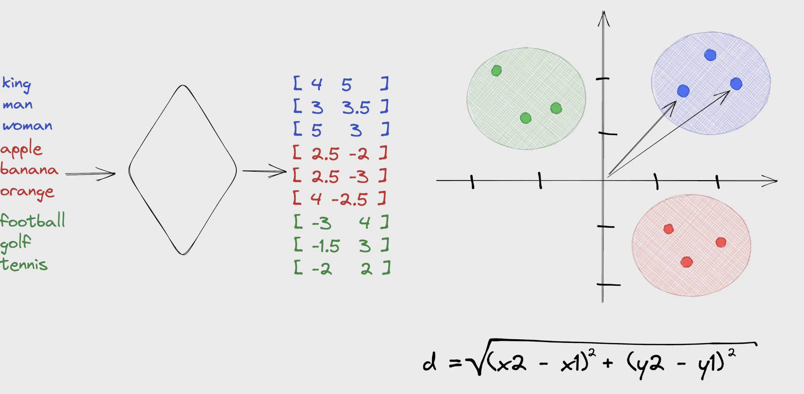
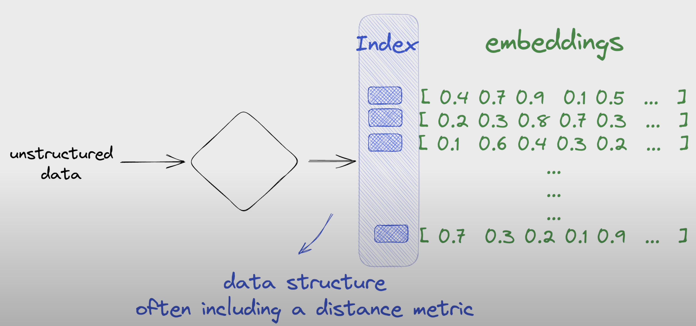
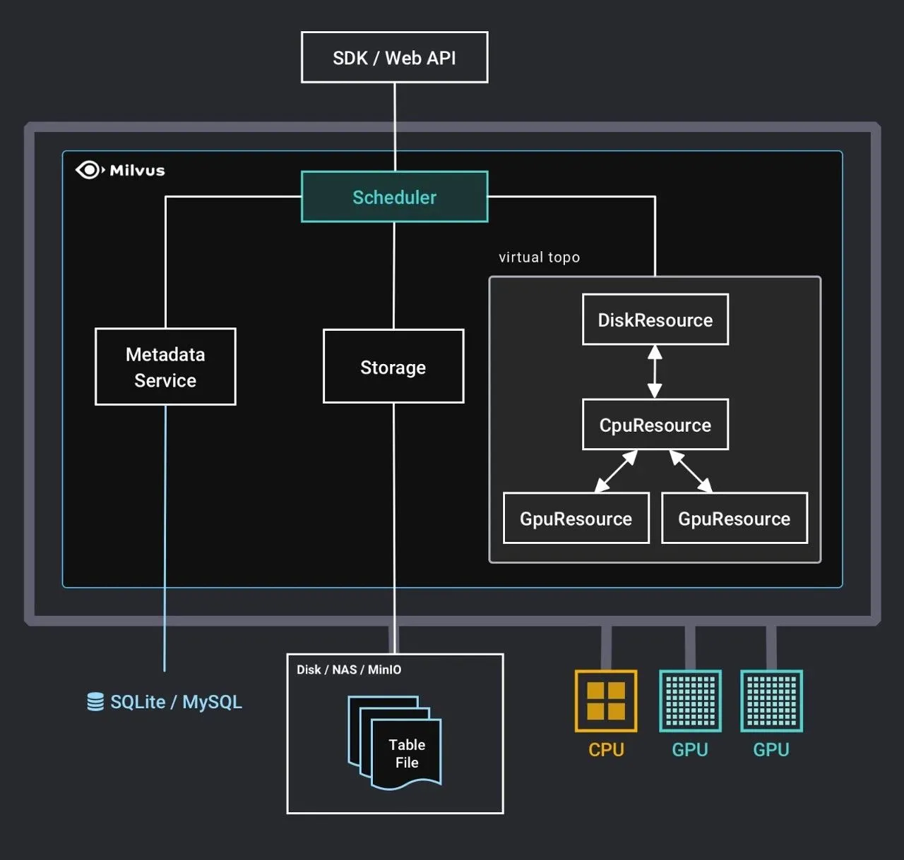

# vectorDB

From unstructured data into structured data, typically using assign the **tag**

A vector database indexes and stores vector embeddings for fast retrieval and similarity search

calculate the distance between

### 最近邻搜索

最近邻搜索问题（Nearest Neighbor, NN）是指根据数据之间的相似性，在数据库中找到和目标数据最相似的点的问题。

比如说图像识别领域，给定一张图片，如何在图片集中找到和它最相似的图像；在电商推荐推荐系统中，给定一个用户喜欢的商品，如何在所有商品中找到和这个商品类似的一些商品进行推荐；在模式识别领域的车牌识别中，如何将车牌照片上的数字字母识别成正确的数字字母；写电子文档时进行的拼写检查、语法检查，如何知道文档中的单词、词组是否正确等等等等，这些都是最近邻搜索的应用场景。

图片、商品等数据在数据库中一般用多维特征向量（vector）表示，数据之间的相似性则转换为它们的特征向量在向量空间之间的距离。衡量向量之间的距离的方式有很多，比如欧式距离，内积相似度和 Jaccard 相似度等等。

> 目前有些数据的特征向量是由 embedding 技术训练出来的，因此特征向量也会被称作 embeddings
> 

最近邻搜索是全量搜索，假设向量的维度是 *D*，数量是 *N*，那么最近邻搜索的时间复杂度是 *O(DN)*，也就是说当搜索数据集特别大，向量维度特别高的时候，最近邻搜索计算量就变得非常大，难以应用在实际问题。所以近似最近邻搜索广受关注。

### 近似最近邻搜索

近似最近邻搜索（Approximate Nearest Neighbor, ANN）顾名思义，搜索出来的结果不要求是精确结果，只需要和精确结果相近即可。ANN的核心思想是牺牲精度来换取速度。

ANN 的方法主要分为两类，一类是基于哈希的方法，第二类是基于量化（Quantization）的方法。

[https://github.com/ngseteam/ANN-papers](https://github.com/ngseteam/ANN-papers)

## Vector Embeddings

## Vector Indexing

## Usecases:

1. Long term memory LLM
2. semantic search: search based on the meanings or context
3. Similarity search for texts, images, audio and video data
4. recommendation engine

## Examples:

1. Pinecone
2. weaviate
3. chroma
4. redis
5. qdrant
6. milvus
7. vespa

[Milvus 向量搜索引擎：查询任务调度原理](https://zhuanlan.zhihu.com/p/110332250)

[examples/search_article_in_medium.ipynb at main · towhee-io/examples](https://github.com/towhee-io/examples/blob/main/nlp/text_search/search_article_in_medium.ipynb)

[Introduction](https://milvus.io/docs/overview.md)

[https://github.com/facebookresearch/faiss](https://github.com/facebookresearch/faiss)

[Billion-scale similarity search with GPUs](https://arxiv.org/abs/1702.08734)

[faiss原理（Product Quantization）](https://zhuanlan.zhihu.com/p/534004381)

LangChain is a framework built around LLMs

[FAISS — 🦜🔗 LangChain 0.0.187](https://python.langchain.com/en/latest/modules/indexes/vectorstores/examples/faiss.html)

[Milvus — 🦜🔗 LangChain 0.0.194](https://python.langchain.com/en/latest/modules/indexes/vectorstores/examples/milvus.html)